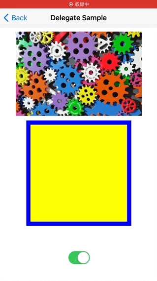
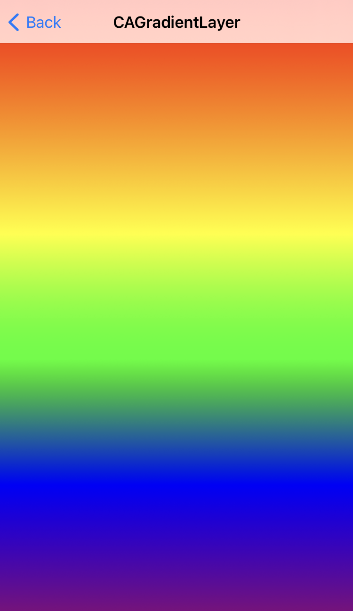
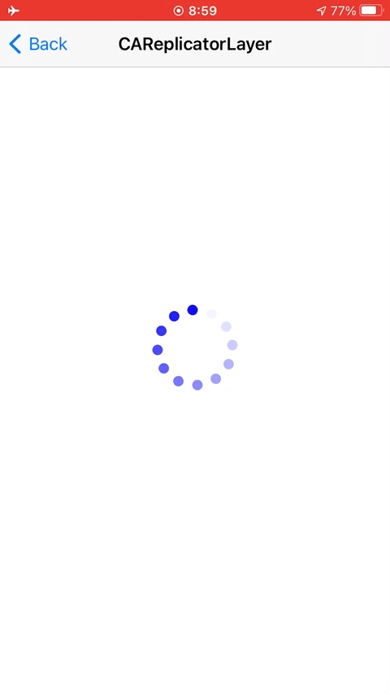
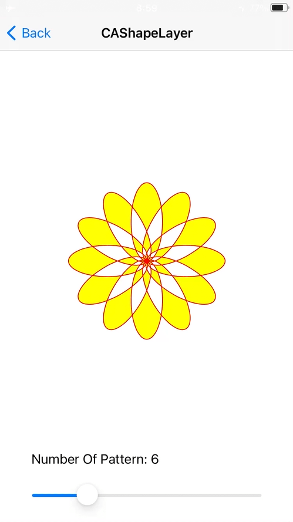
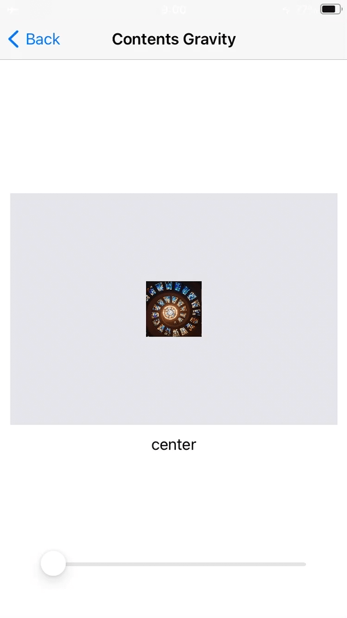
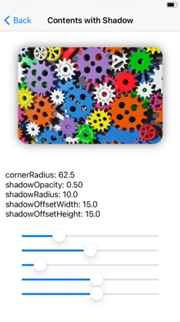
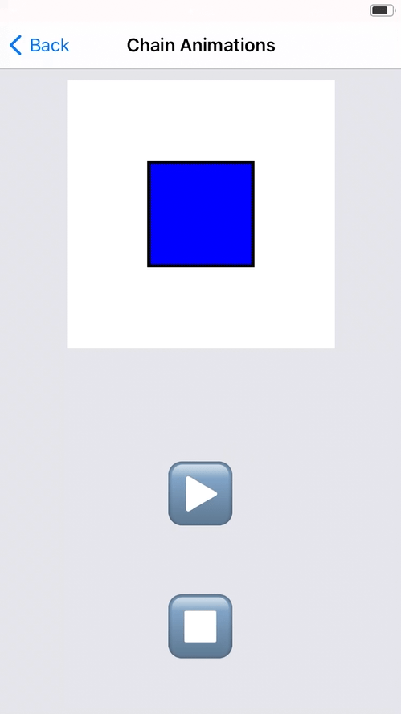

# CoreAnimationZuroku - iOS Core Animation examples

This is a sample code collection for **[Core Animation summarize on my blog](https://snoozelag.hatenablog.com/entry/2021/10/26/055223)**.
 

## How to build

Just build with Xcode 13. 

## Contents

#### Providing a Layer's Contents Ways  

#### CALayer Subtypes  

   

   

  

#### Layers and Animations Samples  

   

  

## Author

**Teruto Yamasaki**

iOS programmer in Japan.

- CONTACTS: [Twitter @snoozelag](https://twitter.com/snoozelag) / [Facebook](https://www.facebook.com/teruto.yamasaki)
